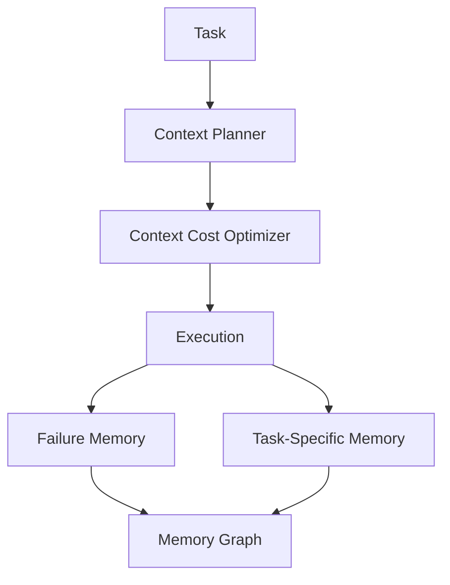

# codex_context_engine

An external memory and context orchestration engine for Codex.

The `codex_context_engine` is an external memory and context orchestration layer designed to help Codex work on complex projects without repeatedly rediscovering the same information.

Instead of reconstructing context from scratch on every task, the engine progressively builds, optimizes and connects contextual knowledge across executions.

The result is a system that becomes **more efficient, more aware of project structure, and less prone to repeating mistakes over time.**

---

# Core Idea

Large coding tasks often fail not because of model capability, but because of **context loss**.

Each run typically starts with limited awareness of:

- project structure
- previous decisions
- past failures
- task-specific knowledge

This leads to repeated exploration, unnecessary context loading, and duplicated reasoning.

`codex_context_engine` addresses this by introducing an **autoincremental context layer** that persists and evolves contextual knowledge across runs.

Instead of starting from zero, the engine gradually accumulates understanding of the project.

---

# How the Engine Works

The engine follows a layered contextual workflow.

Task  
↓  
Context Planner  
↓  
Context Cost Optimizer  
↓  
Execution  
↓  
Failure Memory  
↓  
Task-Specific Memory  
↓  
Memory Graph

Each layer improves how context is selected, used and remembered.

---

# Engine Architecture

---

# Context Planner

Determines **which contextual resources should be loaded** for a given task.

Responsibilities:

- detect task type
- select relevant context sources
- control context depth
- avoid unnecessary exploration

Goal: load the *right* context before execution begins.

---

# Context Cost Optimizer

Reduces token usage and latency by filtering context before it reaches the model.

Responsibilities:

- deduplicate context blocks
- score contextual relevance
- filter oversized or low-value entries
- prioritize useful context

Goal: ensure only high-value context is sent to the model.

---

# Failure Memory

Captures knowledge about **what did not work**.

Responsibilities:

- record failed attempts
- detect recurring friction points
- surface relevant failure patterns

Goal: prevent the engine from repeating ineffective strategies.

---

# Task-Specific Memory

Stores contextual knowledge associated with specific types of tasks.

Responsibilities:

- classify tasks into contextual domains
- persist task-related insights
- retrieve domain-relevant context

Goal: improve contextual precision for repeated workflows.

---

# Memory Graph

Transforms contextual memory into a **connected knowledge structure**.

Responsibilities:

- link tasks, files and decisions
- map contextual relationships
- enable graph-based context discovery

Goal: move from isolated memory records to connected contextual knowledge.

---

# Example

Without the engine:

Task → Codex explores the repository → builds context → executes

With `codex_context_engine`:

Task  
↓  
Planner loads relevant context  
↓  
Optimizer filters context  
↓  
Codex executes with focused context  
↓  
Failure memory records outcome  
↓  
Memory graph connects new knowledge

---

# Key Characteristics

## Autoincremental

The engine continuously accumulates contextual understanding across tasks.

Each execution improves future executions.

---

## Context-first execution

Instead of immediately running a task, the engine first determines:

- what context exists
- what context is relevant
- what context should be ignored

---

## External memory

Contextual knowledge is stored outside the model, allowing:

- persistent project awareness
- cross-task learning
- reproducible contextual state

---

## Failure-aware learning

The engine records mistakes and avoids repeating them.

This reduces exploration cost and accelerates problem solving.

---

# What This Is Not

This project is **not**:

- a prompt collection
- an AI agent framework
- a replacement for Codex

Instead, it is a **context orchestration layer** designed to help Codex maintain and evolve contextual understanding across tasks.

---

# Why This Exists

Large AI-assisted projects frequently suffer from:

- context fragmentation
- repeated discovery work
- token inefficiency
- lack of long-term memory

`codex_context_engine` is an experiment in **treating context as a first-class system**, not a temporary prompt artifact.

---

# Current Status

The engine currently implements:

- context planning
- context optimization
- persistent failure memory
- task-specific contextual memory
- graph-based contextual relationships

Together these components create a layered contextual architecture that progressively improves Codex performance on complex repositories.

---

# Philosophy

The engine follows a simple principle:

> Context should evolve with the project.

Instead of rebuilding understanding every time, the system gradually accumulates structural and experiential knowledge.

Over time this transforms Codex from a stateless assistant into a **context-aware development collaborator**.

---

# License

MIT
